<div align="center">

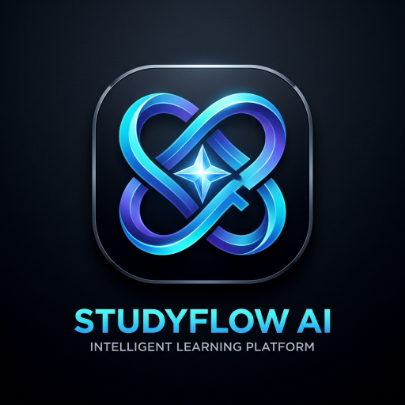

# StudyFlow AI 🎓

### Plan smarter. Study better. Achieve more.

An AI-powered academic command center that brings **tasks, study planning, AI assistance, quizzes, study sessions, and progress tracking** into one modern student-focused platform.

<br>

<a href="https://studyflowve.vercel.app">


</a>

 

<a href="https://github.com/shreyash-bhosale/StudyFlow">


</a>

<br><br>


<br><br>

**A full-stack AI study platform built from the ground up.**

</div>

---

## 🌐 Live Application

<div align="center">

### 🚀 [Open StudyFlow AI](https://studyflowve.vercel.app)

**Production deployment • Full-stack application • AI-powered workflows**

</div>

---

# 📸 Product Preview

## 🖥️ Web Dashboard

<p align="center">

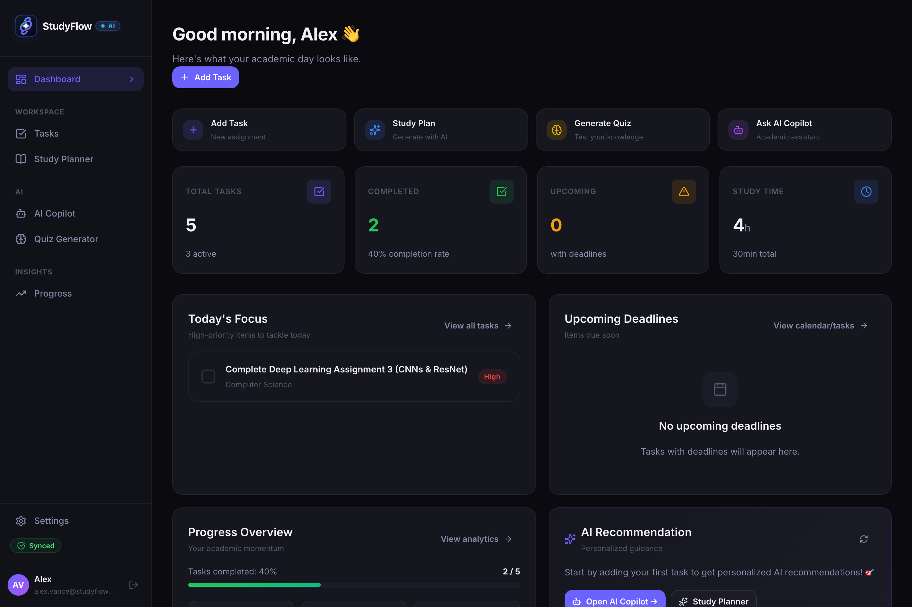

</p>

<p align="center">

<em>Your academic command center — tasks, deadlines, study time and progress at a glance.</em>

</p>

---

## 📱 Mobile Experience

<p align="center">

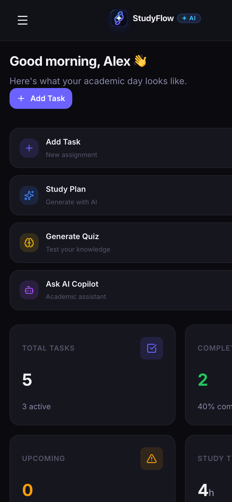

</p>

<p align="center">

<em>Responsive, touch-friendly and designed for studying on the go.</em>

</p>

---

**## 📱 Mobile Screenshots Gallery

<p align="center">
  
  &nbsp;&nbsp;
  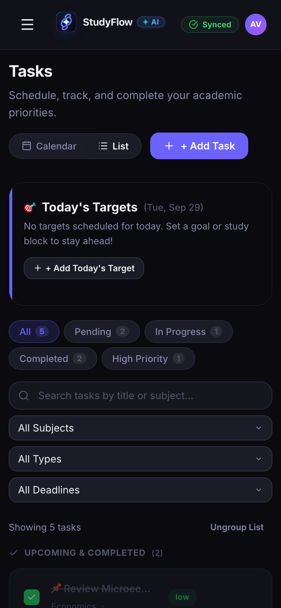
  &nbsp;&nbsp;
  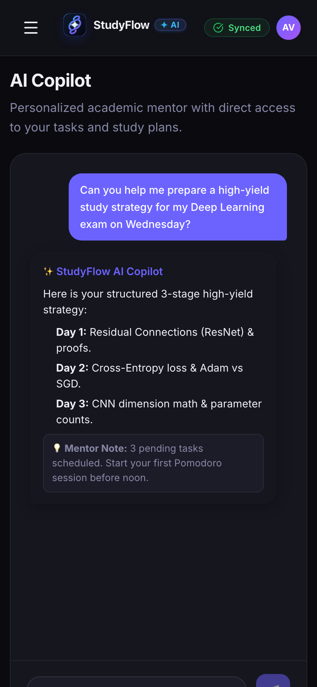
</p>

<p align="center">
  <em>Responsive, touch-friendly StudyFlow AI experience designed for studying on the go.</em>
</p>

Screenshot paths: Make sure the referenced mobile images are committed under docs/screenshots/ with the filenames used above.

🧠 AI-Powered Features**

<div align="center">

| 🤖 AI Copilot | 📝 Quiz Generator | 📅 Study Planner | 🧩 Task Breakdown |

|:---:|:---:|:---:|:---:|

| Academic assistance | AI-generated quizzes | Personalized plans | Actionable milestones |

</div>

---

# ✨ Why StudyFlow?

Students often have their academic life spread across multiple tools:

```text

┌──────────────┐

│   Calendar   │

└──────┬───────┘

   │

┌──────▼───────┐

│ Task Manager │

└──────┬───────┘

   │

┌──────▼───────┐

│     Notes    │

└──────┬───────┘

   │

┌──────▼───────┐

│ AI Assistant │

└──────┬───────┘

   │

┌──────▼───────┐

│    Quizzes   │

└──────┬───────┘

   │

┌──────▼───────┐

│   Progress   │

└──────────────┘

```

### StudyFlow brings these workflows together.

```text

                 🎓 STUDYFLOW AI

                       │

    ┌──────────────────┼──────────────────┐

    │                  │                  │

    ▼                  ▼                  ▼

📋 ORGANIZE         🤖 LEARN          📊 IMPROVE

    │                  │                  │

 Tasks            AI Copilot         Progress

 Deadlines        Quiz Generator     Study Time

 Priorities       Study Planner      Completion

 Subjects         Task Breakdown     Insights

```

---

# 🚀 Features

## 📋 Smart Task Management

Manage your academic workload from a single workspace.

**Capabilities**

- Create tasks

- Edit tasks

- Delete tasks

- Complete tasks

- Set priorities

- Add subjects

- Add deadlines

- View active tasks

- View completed tasks

- Identify today's focus

- Track upcoming deadlines

---

## 🤖 AI Copilot

An academic AI assistant powered by Google Gemini.

Use it for:

- Concept explanations

- Study guidance

- Revision help

- Academic questions

- Planning assistance

- Context-aware study support

### Request flow

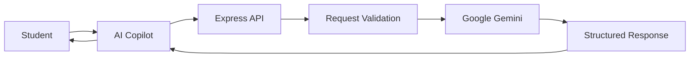

---

## 🧠 AI Quiz Generator

Turn any topic into an interactive practice session.

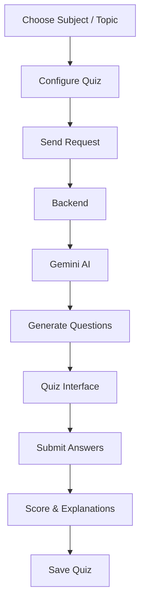

### Quiz workflow

**Choose topic → Generate → Attempt → Score → Review → Improve**

---

## 📅 AI Study Planner

Generate structured study schedules based on academic requirements.

The planner can work with information such as:

- Subjects

- Topics

- Exam dates

- Available study time

- Priorities

- Academic goals

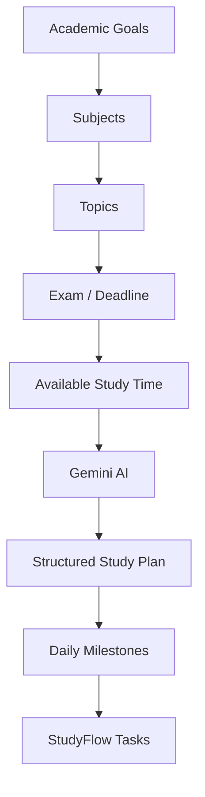

---

## 🧩 AI Task Breakdown

Large assignments can become difficult when treated as one giant task.

StudyFlow can transform them into smaller actionable milestones.

```text

                Large Assignment

                       │

                       ▼

              ┌─────────────────┐

              │    Gemini AI     │

              └────────┬────────┘

                       │

        ┌──────────────┼──────────────┐

        ▼              ▼              ▼

   Research        Development      Testing

        │              │              │

        ▼              ▼              ▼

    Milestone 1     Milestone 2     Milestone 3

        │              │              │

        └──────────────┼──────────────┘

                       ▼

                 Completed Task

```

---

# 📊 Progress Dashboard

StudyFlow turns raw academic activity into simple visual insights.

### Dashboard metrics include:

- Total tasks

- Active tasks

- Completed tasks

- Completion rate

- Upcoming deadlines

- Study time

- Today's focus

- Academic activity

The goal is simple:

> **Know what needs to be done, what has been completed, and what needs attention next.**

---

# ⏱️ Study Sessions

Track study activity and build a clearer picture of where your time goes.

Study sessions can contribute to:

- Total study time

- Productivity insights

- Dashboard statistics

- Progress tracking

---

# 📴 Offline-First Architecture

StudyFlow is designed so core productivity workflows can continue to work even when connectivity is unavailable.

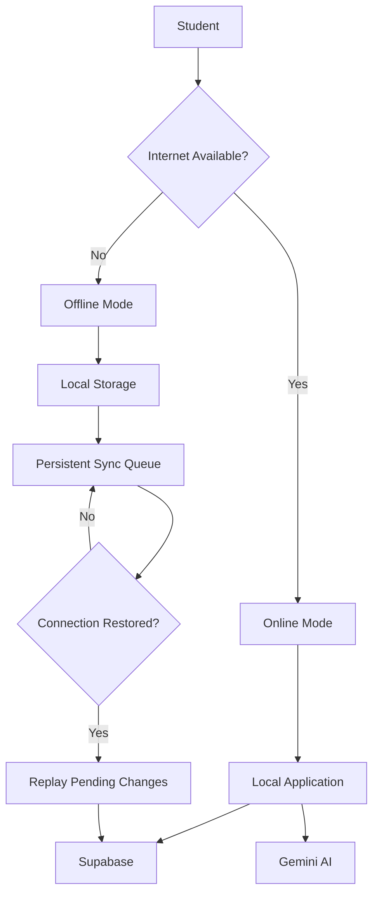

### Offline capabilities

- Cached application shell

- Local data access

- Persistent synchronization queue

- Offline mutation tracking

- Reconnection synchronization

- Manual sync controls

- Offline-friendly productivity workflows

> AI generation requires an internet connection because requests are processed through the backend and Gemini API.

---

# ☁️ Cloud Synchronization

StudyFlow follows a local-first → cloud-sync approach for supported data workflows.

```text

             USER ACTION

                  │

                  ▼

           Local Application

                  │

         ┌────────┴────────┐

         │                 │

      ONLINE             OFFLINE

         │                 │

         ▼                 ▼

    Supabase         Sync Queue

         │                 │

         │          Connection Restored

         │                 │

         └────────┬────────┘

                  ▼

            Cloud Storage

```

This allows the application to provide a responsive local experience while retaining cloud persistence when connectivity is available.

---

# 💾 Backup & Restore

StudyFlow provides local JSON backup functionality for supported academic data.

### Export

```text

StudyFlow Data

  │

  ▼

JSON Backup

  │

  ▼

Your Device

```

### Restore

```text

JSON Backup

  │

  ▼

Import

  │

  ▼

StudyFlow

  │

  ▼

Restored Data

```

Backups are intended as an additional way for users to preserve their academic data.

---

# 🏗️ System Architecture

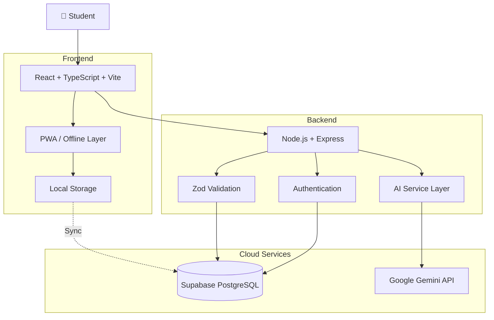

---

# 🔄 Complete Product Flow

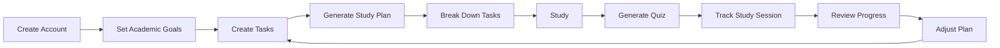

### In simple terms:

**Plan → Organize → Study → Practice → Track → Improve**

---

# 🧱 Project Architecture

```text

StudyFlow/

│

├── 📁 api/

│   └── Vercel API entrypoints

│

├── 📁 backend/

│   ├── src/

│   │   ├── routes/

│   │   ├── services/

│   │   ├── middleware/

│   │   └── ...

│   ├── package.json

│   └── tsconfig.json

│

├── 📁 frontend/

│   ├── public/

│   │   ├── icons/

│   │   └── ...

│   ├── src/

│   │   ├── components/

│   │   ├── pages/

│   │   ├── services/

│   │   ├── hooks/

│   │   └── ...

│   ├── package.json

│   └── vite.config.*

│

├── 📁 docs/

│   └── screenshots/

│

├── 📁 .agents/

│   └── rules/

│

├── 📄 package.json

├── 📄 package-lock.json

├── 📄 supabase-schema.sql

├── 📄 tsconfig.json

├── 📄 vercel.json

└── 📄 README.md

```

---

# 🛠️ Technology Stack

<div align="center">

| Layer | Technology |

|---|---|

| 🎨 Frontend | React 18 |

| 🧠 Language | TypeScript |

| ⚡ Build Tool | Vite |

| 🧭 Routing | React Router |

| 🎯 Icons | Lucide |

| 📊 Charts | Recharts |

| 🔔 Notifications | React Hot Toast |

| 🖥️ Backend | Node.js + Express |

| 🛡️ Validation | Zod |

| 🗄️ Database | Supabase PostgreSQL |

| 🔐 Authentication | Supabase Auth / JWT |

| 🤖 AI | Google Gemini API |

| 📱 Offline | Service Worker + Local Storage |

| ☁️ Deployment | Vercel |

| 🐙 Version Control | Git + GitHub |

</div>

---

# 🔐 Security

StudyFlow follows a server-side architecture for sensitive AI credentials and uses database-level access controls.

### 🔑 API Key Protection

The Gemini API key is kept on the backend and should never be exposed in frontend code.

### 🛡️ Supabase Row Level Security

Supabase RLS policies can restrict users to authorized database records.

### ✅ Request Validation

Backend requests are validated using Zod where applicable.

### 🔐 Authentication

User authentication is handled through Supabase Auth and JWT-based sessions.

### 🚫 Secret Management

Never commit:

```text

.env

.env.local

SUPABASE_SERVICE_ROLE_KEY

GEMINI_API_KEY

```

Production secrets should be configured through the deployment platform's environment variables.

---

# 🔌 API Overview

Representative API endpoints include:

```text

GET    /api/health

POST   /api/auth/login

GET    /api/tasks

POST   /api/tasks

PATCH  /api/tasks/:id

DELETE /api/tasks/:id

GET    /api/study-sessions

GET    /api/study-plans

GET    /api/quizzes

POST   /api/ai/recommendation

POST   /api/ai/copilot

POST   /api/ai/quiz

POST   /api/ai/study-plan

POST   /api/ai/task-breakdown

```

The exact request and response contracts are defined in the backend implementation.

---

# 🚀 Getting Started

## Prerequisites

Make sure you have:

- Node.js 18+

- npm

- Git

- Supabase project

- Google Gemini API key

---

## 1. Clone

```bash

git clone https://github.com/shreyash-bhosale/StudyFlow.git

cd StudyFlow

```

---

## 2. Install Dependencies

### Root

```bash

npm install

```

### Backend

```bash

cd backend

npm install

```

### Frontend

```bash

cd ../frontend

npm install

cd ..

```

---

# 🔐 Environment Variables

## Backend

Create:

```text

backend/.env

```

```env

PORT=3001

NODE_ENV=development

SUPABASE_URL=https://your-project.supabase.co

SUPABASE_ANON_KEY=your-anon-key

SUPABASE_SERVICE_ROLE_KEY=your-service-role-key

GEMINI_API_KEY=your-gemini-api-key

FRONTEND_URL=http://localhost:5173

```

## Frontend

Create:

```text

frontend/.env

```

```env

VITE_SUPABASE_URL=https://your-project.supabase.co

VITE_SUPABASE_ANON_KEY=your-anon-key

VITE_API_URL=http://localhost:3001

```

---

# 🗄️ Database Setup

1. Create a Supabase project.

2. Open **Supabase Dashboard → SQL Editor**.

3. Open:

```text

supabase-schema.sql

```

4. Copy the SQL into the SQL Editor.

5. Execute the schema.

6. Verify the required tables and RLS policies.

Core entities include:

```text

profiles

tasks

study_plans

study_sessions

quizzes

```

---

# 💻 Run Locally

From the project root:

```bash

npm run dev

```

Or run the applications independently:

### Backend

```bash

npm run dev:backend

```

Default development API:

```text

http://localhost:3001

```

### Frontend

```bash

npm run dev:frontend

```

Default development frontend:

```text

http://localhost:5173

```

---

# 🧪 Testing Checklist

Before deploying a new version, verify:

```text

Authentication

├── Sign up

├── Login

├── Logout

└── Session persistence

Tasks

├── Create

├── Read

├── Update

├── Complete

└── Delete

AI

├── AI Copilot

├── Quiz Generation

├── Study Plan Generation

├── Task Breakdown

└── Recommendations

Study

├── Study Sessions

├── Progress

└── Study Time

Offline

├── Offline launch

├── Local data

├── Queue mutations

└── Reconnection sync

Production

├── Environment variables

├── API routing

├── Frontend build

├── Backend build

└── Production deployment

```

---

# ☁️ Deployment

StudyFlow AI is deployed on **Vercel**.

### Production

**https://studyflowve.vercel.app**

### Architecture

```text

              studyflowve.vercel.app

                       │

          ┌────────────┴────────────┐

          │                         │

          ▼                         ▼

    React Frontend              /api/\*

          │                         │

          │                         ▼

          │                   Express API

          │                         │

          │              ┌──────────┴──────────┐

          │              ▼                     ▼

          │         Supabase                  Gemini

          │         PostgreSQL                 AI

          │

          └──────── User Interface

```

Deployment configuration is maintained in:

```text

vercel.json

```

---

# 📱 Mobile / PWA

StudyFlow is designed to provide a mobile-friendly application experience.

On supported browsers:

1. Open [StudyFlow AI](https://studyflowve.vercel.app).

2. Open the browser menu.

3. Select **Add to Home Screen** or **Install App** when available.

4. Launch StudyFlow from your device.

PWA installation behavior depends on browser and operating-system support.

---

# 🗺️ Roadmap

### 📚 Academic Intelligence

- [ ] Smarter personalized recommendations

- [ ] Spaced repetition

- [ ] Revision recommendations

- [ ] Adaptive study plans

### 📊 Analytics

- [ ] Advanced study analytics

- [ ] Weekly productivity reports

- [ ] Subject-level performance

- [ ] Long-term progress trends

### 🔔 Productivity

- [ ] Push notifications

- [ ] Recurring tasks

- [ ] Calendar integration

- [ ] Exam countdowns

- [ ] Smart reminders

### 🧠 AI

- [ ] More quiz formats

- [ ] AI revision mode

- [ ] AI-generated flashcards

- [ ] Personalized learning paths

---

# 🎯 Product Philosophy

StudyFlow isn't designed to simply give students another place to write down tasks.

The goal is to connect the entire academic workflow:

```text

         GOAL

          │

          ▼

       PLAN

          │

          ▼

      ORGANIZE

          │

          ▼

        STUDY

          │

          ▼

       PRACTICE

          │

          ▼

       MEASURE

          │

          ▼

       IMPROVE

          │

          └──────────────► REPEAT

```

### The idea is simple:

> **Turn academic goals into actionable work, use AI where it adds value, and make progress visible.**

---

# 🧪 Example

Imagine an exam is 14 days away.

Instead of manually figuring out everything:

```text

Exam

├── Mathematics

├── Physics

└── Computer Science

```

StudyFlow can transform the academic requirements into a structured workflow:

```text

Day 01

├── Mathematics → Algebra

└── Physics → Mechanics

Day 02

├── Mathematics → Practice

└── Computer Science → Data Structures

Day 03

├── Physics → Numericals

└── Computer Science → Revision

...

Day 14

├── Final Revision

└── Practice Quiz

```

The student can then track the work directly inside StudyFlow.

---

# 📸 More Screenshots

### 📋 Task Management

<p align="center">

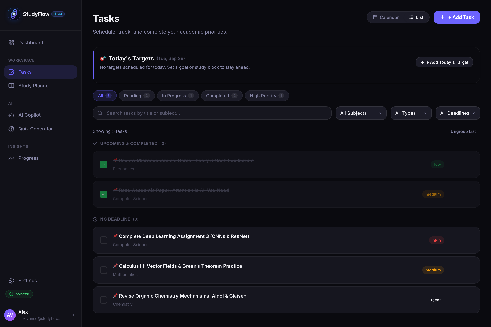

</p>

---

### 🤖 AI Copilot

<p align="center">

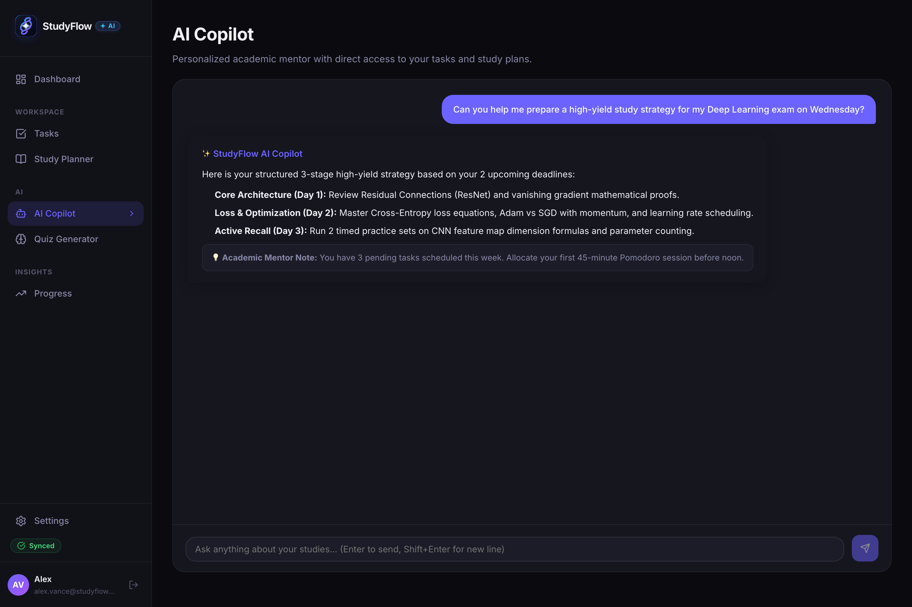

</p>

---

### 🧠 Quiz Generator

<p align="center">

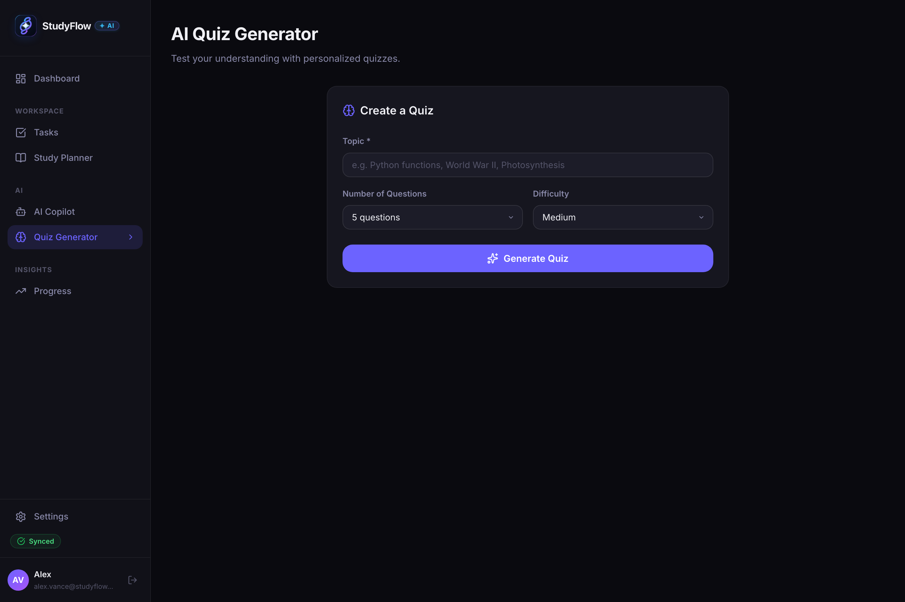

</p>

---

### 📅 Study Planner

<p align="center">

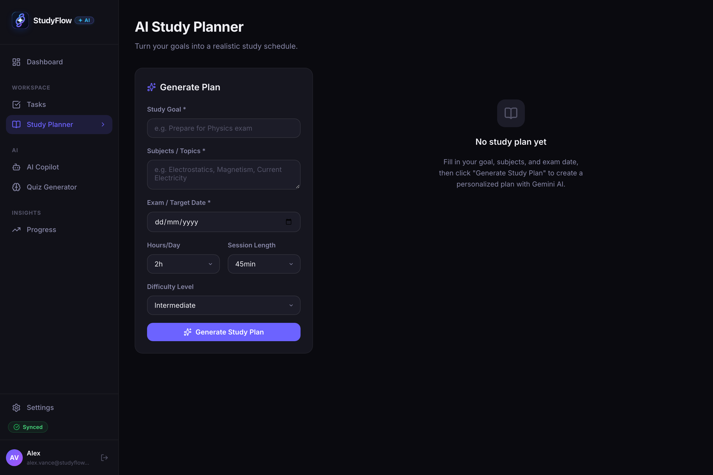

</p>

---

# 🤝 Contributing

Contributions, ideas, improvements and bug reports are welcome.

```bash

# Fork the repository

# Clone your fork

git clone https://github.com/YOUR_USERNAME/StudyFlow.git

# Create a feature branch

git checkout -b feature/your-feature

# Make your changes

# Commit

git add .

git commit -m "feat: add your feature"

# Push

git push origin feature/your-feature

```

Then open a Pull Request.

---

# 🐛 Bug Reports

When reporting an issue, include:

- What you were trying to do

- Expected behavior

- Actual behavior

- Browser/device

- Steps to reproduce

- Console/server errors

- Screenshots when useful

---

# 📄 License

This project is licensed under the **MIT License**.

See [`LICENSE`](./LICENSE) for details.

---

# 👨‍💻 Built By

<div align="center">

### Shreyash Bhosale

Building at the intersection of **AI, software engineering and student productivity.**

<br>

<a href="https://github.com/shreyash-bhosale">


</a>

<br><br>

**StudyFlow AI**

[🚀 Live Demo](https://studyflowve.vercel.app) · [💻 GitHub Repository](https://github.com/shreyash-bhosale/StudyFlow)

</div>

---

<div align="center">

## 🎓 Study smarter. Build better habits. Go beyond average.

<br>

⭐ **If you find StudyFlow interesting, consider giving the repository a star.**

<br>

Made with ❤️, React, TypeScript, Supabase, Node.js & Gemini AI.

</div>
